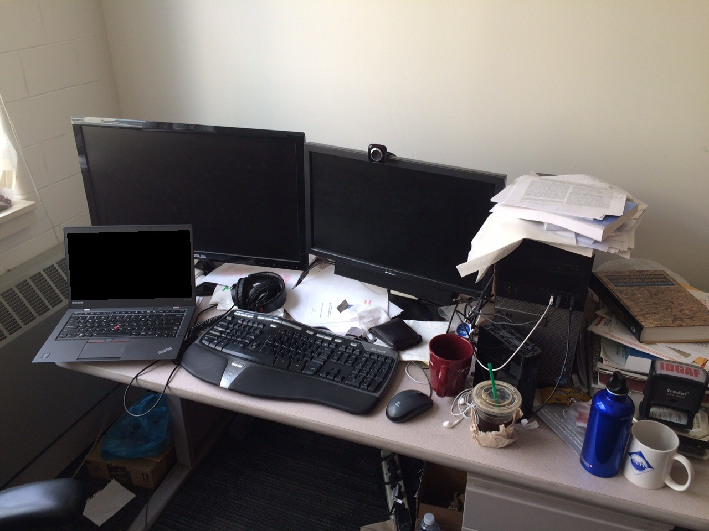

# ailia MODELS Rust

This repository is an example of using the ailia SDK from rust.

## Requirements
* `opencv` 4.7.0 or later
* `rust` 1.78.0 or later
* `ailia SDK` 1.3.0 or later

## Usage

## Install ailia SDK

```
git submodule init
git submodule update
```

## Download license file

Download the ailia SDK license file with the following command. The license file is valid for one month.

```
cd ailia
python3 download_license.py
```

Alternatively, the license file can be obtained by requesting the evaluation version of the ailia SDK.

[Request trial version](https://axinc.jp/en/trial/)

### Path configuration

for linux user

```bash
export AILIA_INC_DIR=../../ailia/library/include
export AILIA_BIN_DIR=../../ailia/library/linux
export LD_LIBRARY_PATH=../../ailia/library/linux:LD_LIBRARY_PATH
```

for mac user

```bash
export AILIA_INC_DIR=../../ailia/library/include
export AILIA_BIN_DIR=../../ailia/library/mac
export DYLD_LIBRARY_PATH=../../ailia/library/mac:DYLD_LIBRARY_PATH
```

download model

```
python3 download_onnx.py --url_dir detic --model Detic_C2_SwinB_896_4x_IN-21K+COCO_lvis
```

build

```
cd detic
cargo update
cargo clean
cargo build
```

## Models

| | Model | Reference | Exported From | Supported Ailia Version | Blog |
|:-----------|------------:|:------------:|:------------:|:------------:|:------------:|
 [](/detic/) | [detic](/detic/) | [Detecting Twenty-thousand Classes using Image-level Supervision](https://github.com/facebookresearch/Detic) | Pytorch | 1.2.10 and later | [EN](https://medium.com/p/49cba412b7d4) [JP](https://medium.com/axinc/detic-21k%E3%82%AF%E3%83%A9%E3%82%B9%E3%82%92%E9%AB%98%E7%B2%BE%E5%BA%A6%E3%81%AB%E3%82%BB%E3%82%B0%E3%83%A1%E3%83%B3%E3%83%86%E3%83%BC%E3%82%B7%E3%83%A7%E3%83%B3%E3%81%A7%E3%81%8D%E3%82%8B%E7%89%A9%E4%BD%93%E6%A4%9C%E5%87%BA%E3%83%A2%E3%83%87%E3%83%AB-1b8f777ee89a) |
| |[lightweight-human-pose-estimation](/pose_estimation/) | [Fast and accurate human pose estimation in PyTorch.<br/>Contains implementation of <br/>"Real-time 2D Multi-Person Pose Estimation on CPU: Lightweight OpenPose" paper.](https://github.com/Daniil-Osokin/lightweight-human-pose-estimation.pytorch) | Pytorch | 1.2.1 and later | [EN](https://medium.com/axinc-ai/lightweighthumanpose-a-machine-learning-model-for-fast-multi-person-skeleton-detection-631c042bed50) [JP](https://medium.com/axinc/lightweighthumanpose-%E9%AB%98%E9%80%9F%E3%81%AB%E8%A4%87%E6%95%B0%E4%BA%BA%E3%81%AE%E9%AA%A8%E6%A0%BC%E3%82%92%E6%A4%9C%E5%87%BA%E3%81%99%E3%82%8B%E6%A9%9F%E6%A2%B0%E5%AD%A6%E7%BF%92%E3%83%A2%E3%83%87%E3%83%AB-bc34d420e6e2) |
| [](/resnet18_ailia_classifier/) | [resnet18](/resnet18_ailia_classifier/) | [ResNet18]( https://pytorch.org/vision/main/generated/torchvision.models.resnet18.html) | Pytorch | 1.2.8 and later | |
| [](/yolox/) | [yolox](/yolox/) | [YOLOX](https://github.com/Megvii-BaseDetection/YOLOX) | Pytorch | 1.2.6 and later | [EN](https://medium.com/axinc-ai/yolox-object-detection-model-exceeding-yolov5-d6cea6d3c4bc) [JP](https://medium.com/axinc/yolox-yolov5%E3%82%92%E8%B6%85%E3%81%88%E3%82%8B%E7%89%A9%E4%BD%93%E6%A4%9C%E5%87%BA%E3%83%A2%E3%83%87%E3%83%AB-e9706e15fef2) |

## Examples

- [ailia_yolox_rust](https://github.com/axinc-ai/ailia_yolox_rust)